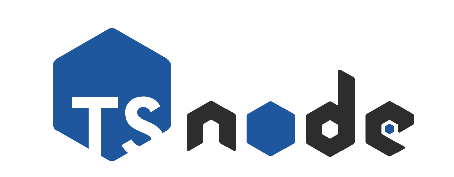

<!-- PROJECT LOGO -->
<br />
<p align="center">
  <a href="#">
    
    
  </a>

  <h3 align="center">Nx-Nodejs-Typescript/GraphQL/Express/MongoDB Boilerplate</h3>

  <p align="center">
    A 👨🏻‍💻 Nx-Node-Typescript/Express/MongoDB Boilerplate with User Authentication and Authorization with JWT support.This is an updated version of Sam Quinn's bulletproof-nodejs implementation<a href="https://github.com/santiq/bulletproof-nodejs"> Link to Repo </a><br /><br />
    This project was generated using <a href="https://nx.dev">Nx</a>.
    <br />
    <br />
    <a href="https://github.com/DevUnderflow/nx-node-typescript-api/issues/new?assignees=&labels=&template=bug_report.md&title=">🐞 Bug Report</a> &nbsp;&nbsp;
    <a href="https://github.com/DevUnderflow/nx-node-typescript-api/issues/new?assignees=&labels=&template=feature_request.md&title=">📢 Feature Request</a>
    <br />
  </p>
<p align="center">
<a href="https://github.com/DevUnderflow/nx-node-typescript-api/blob/master/LICENSE">
    
</a>
<a href="https://github.com/DevUnderflow/nx-node-typescript-api/issues">
    
</a>
<a href="#">
    
</a>
</p>
</p>

## Tech Stack

🔎 **Nx is a set of Extensible Dev Tools for Monorepos.**

* [Node.js](https://nodejs.org/en/), [TypeScript](https://www.typescriptlang.org/) , [JWT](https://jwt.io/), [Prettier](https://prettier.io/)— core platforms.
* [MongoDB](https://www.mongodb.com/) — data access and db automation.
* [Jest](https://jestjs.io/) - unit and snapshot testing.


## Development

We use `node` version `10.15.0`

```
nvm install 10.15.0
```

```
nvm use 10.15.0
```

The first time, you will need to run

```
npm install
```

Run `nx serve ` for a dev server. Navigate to http://localhost:4000/. The app will automatically reload if you change any of the source files.


## Build

Run `npm run build ` to build the project. The build artifacts will be stored in the `dist/` directory. Use the `--prod` flag for a production build.

## Understand your workspace

Run `nx dep-graph` to see a diagram of the dependencies of your projects.

## Further help

Visit the [Nx Documentation](https://nx.dev) to learn more.

## Roadmap
- [x] Typescript class based implementation.
- [x] Add GraphQL Support.
- [ ] CRUD Operations.
- [ ] Unit tests.

<!-- CONTRIBUTING -->
## Contributing

Contributions are what make the open source community such an amazing place to be learn, inspire, and create. Any contributions you make are **greatly appreciated**.

1. Fork the Project
2. Create your Feature Branch (`git checkout -b feature/AmazingFeature`)
3. Commit your Changes (`git commit -m 'Add some AmazingFeature'`)
4. Push to the Branch (`git push origin feature/AmazingFeature`)
5. Open a Pull Request

<!-- LICENSE -->
## License

Distributed under the MIT License. See `LICENSE` for more information.
